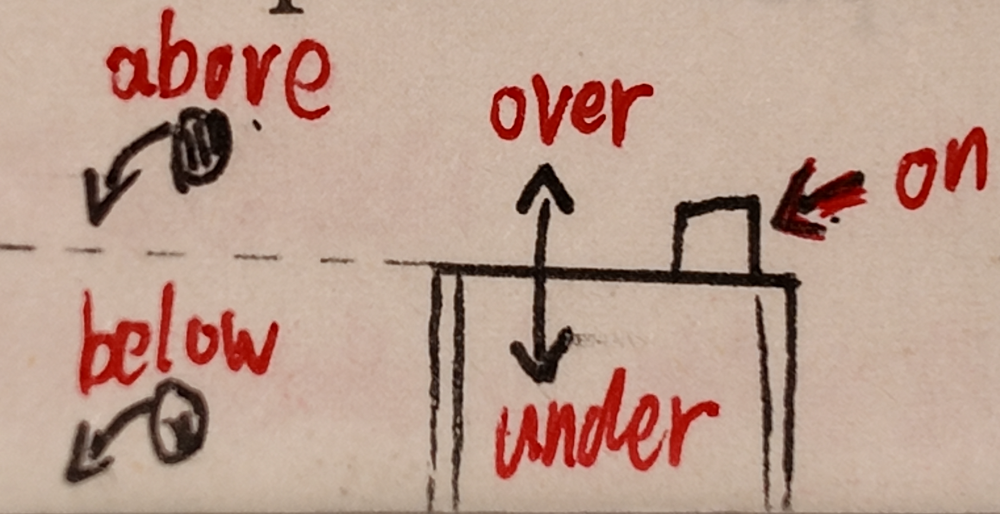
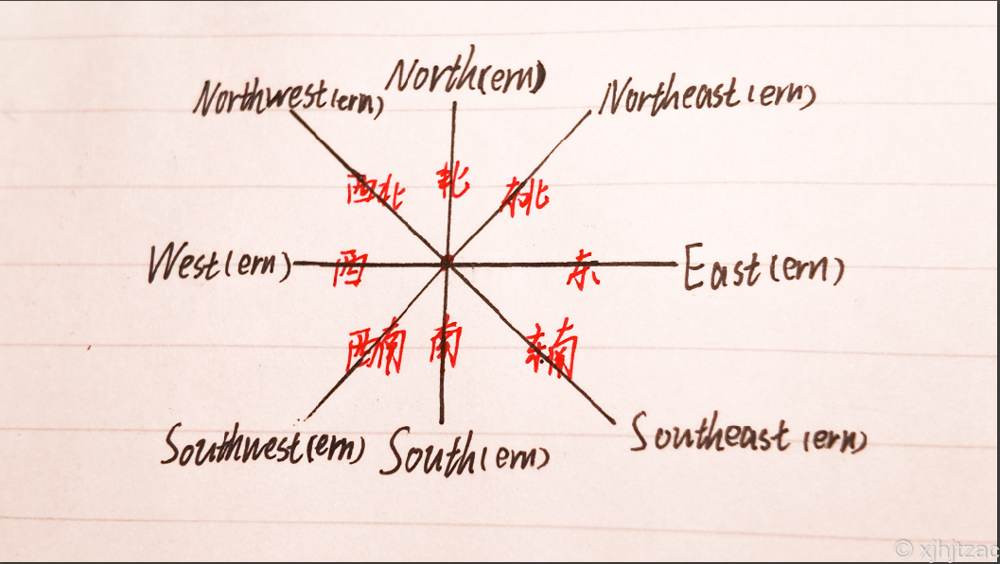

# Unit4 第四单元部分

*注：部分单词的汉译为斜体，代表这个释义课本上没有但真实存在，为编者所加*

### wonder n. 奇观；惊叹  v. 琢磨；想知道；感到诧异

    **相关单词**：

        wonderful adj.绝妙的；令人惊叹的

     **相关短语**：

        in wonder 惊叹的

        wonder that + **从句** 对...感到诧异

        wonder at 对...感到诧异

    **备注**：

        wonder**作名词**时，为可数名词正常加S。

        wonder意为“**想知道**”时，等于 want to know

### desert n.沙漠；荒原

### measurement n. 数量；测量

### square kilometre 平方千米

### below prep. & adv. 在……下面；低于

> 💡**Tips**：常见的**方位介词**辨析：
> 
> 
> 
> 如此图所示。下面具体讲一下他们的不同。
> 
> - **on (在...上)**：**必须接触**。物体直接贴在表面上。
> 
> - **above (在...上方)**：**不接触**。只要位置高就行，不一定是正上方。
> 
> - **over (在...正上方)**：**不接触**，但强调**垂直的正上方**或**跨过/覆盖**。
> 
> - **below (在...下方)**：对应 **above**。只表示位置比...低（泛指下方），不强调正下方。
> 
> - **under (在...下)**：对应 **over**。强调**垂直的正下方**或**被遮盖/托起**。

### level n. 高度；水平；程度

### sea level 海平面

### surface n. 表面；表层

    **相关短语**：

        on the surface 从表面上看

    **备注**：

        surface指水面、液体表面时**通常以单数形式出现**，其他情况为**可数名词**正常加S。

### depth n. 深（度）；纵深

    **相关单词**：

        如下表。  

| 词性/意思 | 长      | 宽     | 高      | 深     |
| ----- | ------ | ----- | ------ | ----- |
| adj.  | long   | wide  | high   | deep  |
| n.    | length | width | height | depth |

    **常用表达**：

        *What's the depth of ... ?*    ...的深度是多少？

        还可用 *How deep is/are ... ?* 提问。

        **答法**：

            **基数词+单位+deep**   例：*3 metres deep*

            **基数词+单位+in depth**   例：*3 metres in depth*

### dive v. & n. 潜水；跳水；俯冲

    **相关单词**：

        diver n.潜水员

### submersible n.潜水艇

### unusual adj. 特别的；不寻常的

    **相关单词**：

        usual adj.寻常的，普遍的  n.寻常

        usually adv.寻常地

    **备注**：

        不定冠词用**an**。

### bottom n. 底部；最下部

    **相关短语**：

        at the bottom of 在...底部

        from top to bottom 从上到下

### waterfall n. 瀑布

### civilization n. 文明

    **备注**：

        civili**z**ation=civili**s**ation

        当其表示“具体的某种文明（如古埃及文明）“时，是**可数**名词。当前表示“文明”这种抽象概念时，为**不可数**名词。

### development n. 发展；壮大

    **相关单词**：

        develop v.发展；开发

        developed adj.发达的

        developing adj.发展中的

    **相关短语**：

        in the development of  ...在不断发展

### cubic adj. 立方的

### cubic metre 立方米

### mile n. 英里

    **相关单词**：

        foot n.英尺（可数名词变复数时正常加S）

        inch n.英寸（可数名词变复数时加**es**）

    **备注**：

        可数名词变复数时正常加S。

### pool n. 池塘；水坑；*游泳池*

### climber n. 攀登者；登山者

    **相关单词**：

        climb v.攀登

### northern adj. 北部的；向北的

    **相关单词**：

    如图所示。

> 💡**Tips**：表示**方向**的词语
> 
> 
> 
> **他们分别是**：
> 
> **东**(east)、**西**(west)、**南**(south)、**北**(north)、**东南**(southeast)、**西南**(southwest)、**东北**(northeast)、**西北**(northwest)。
> 
> 如果想要把他们变成**形容词**，只需要在单词结尾加一个`-ern`词缀即可。如东(east)，东方的(east**ern**)。

### distance n.距离；遥远

    **相关短语**：

        in the distance 在远处

        distance of ...的距离

### survive v. 生存；存活；艰难度过；*幸免于难*

### condition n. 环境；条件；状态

    **相关短语**：

        in good condition 状态良好

        out of condition 状态不佳

    **备注**：

        condition当**条件**讲时，为可数名词正常加S。当**环境、状态**讲时，则为不可数名词。

### degree n. 度；度数；程度

    **备注**：

        可数名词正常加S。

### cliff n. 悬崖；峭壁

    **备注**：

        可数名词正常加S。

### changeable adj. 可能变化的；易变的；常变的

    **相关单词**：

        change v.改变

### death n. 死亡；毁灭；破灭

    **相关单词**：

        die v.死亡

            died(die的过去式)

            dying(die的-ing形式)

        dead adj.死亡的

        dying adj.濒死的

### determined adj. 有决心的；坚决的

    **相关短语**：

        be determined to do sth 决定做某事

### above prep. 在 (……) 上面；高于；*超过*

    **相关单词**：

        （反义词）below prep.在...下

### teammate n. 同队队员；队友

    **相关单词**：

        classmate n.同班同学

### shoulder n. 肩膀；肩部

    **相关短语**：

        on one's shoulders 落在某人的肩膀上

        shoulder to shoulder 肩并肩

    **备注**：

        可数名词正常加S。

### bit by bit 一点一点地；逐渐地

    **备注**：

        bit by bit = little by little

### ladder n. 梯子；阶梯；途径

    **备注**：

        可数名词正常加S。

### measure v. 测量；量度为  n. 措施；度量单位

    **相关单词**：

        measurement n.测量

### successfully adv. 成功地；顺利地

    **相关单词**：

        succeed v.成功

        success n.成功

        successful adj.成功的

### risk v. 使……冒风险（或面临危险） n. 危险；风险

    **相关短语**：

        risk one's life to do sth 冒某人生命危险做某事

        have/take a risk =have/take risks 有风险

### curiosity n. 好奇心；求知欲

    **备注**：

        可数名词，变复数时**把y变i加es**，即`curiosities`。

### ambition n. 追求的目标；野心；雄心

    **备注**：

        可数名词正常加S。

### explorer n. 探险者；勘探者

    **相关单词**：

        explore v.探索

### simply adv. 仅仅；只；简单地

    **相关单词**：

        simple adj.简单的

### risky adj. 有危险（或风险）的

    **相关单词**：risk v. 使……冒风险（或面临危险）；n. 危险；风险

### southern adj. 南部的；向南的

    **相关单词**：

        请见`northern`词条。

### located adj. 位于；坐落在

    **相关单词**：

        locate v.确定……的位置，探明；设立，建立

        location n.地点，位置

    **相关短语**：

        be located in 位于

### freshwater adj. 淡水的；淡水中生长的

### type n. 类型；种类

    **备注**：

        可数名词正常加S。

        type当**种类**讲时，等于kind。

### attract v. 吸引；招引

    **相关短语**：

        attract one's attention 吸引某人的注意力

### curious adj. 好奇的；求知欲强的

    **相关短语**：

        be curious about 对...好奇

### traveller n. 旅行者；游客

    **相关单词**：
        travel v.旅游

    **备注**：

        可数名词正常加S。

        traveller = traveler

### natural adj. 自然的；天然的；天生的

    **相关单词**：

        nature n.自然

### reef n. 礁；礁脉

    **备注**：

        可数名词正常加S。

### underwater adj. 水下的；用于水下的  adv. 在水下

### northeastern adj. 东北的；东北方向的

    **相关单词**：

        请见`northern`词条。

### coast n. 海岸；海滨

    **相关短语**：

        on the coast of 滨海

### coral n. 珊瑚；珊瑚虫

    **备注**：

        coral当珊瑚讲时**不可数**，当珊瑚虫讲时为**可数名词**。

### include v. 包含；包括

### sand n. 沙子

    **相关单词**：

        sands n.沙滩

        sandy adj.含沙的

    **备注**：
            不可数名词。

### alive adj. 活着；在世；有活力

### structure n. 结构（体）；构造；体系

    **相关短语**：
            structure of ...的结构

    **备注**：

        可数名词正常加S。

### turtle n. 海龟；龟

    **备注**：

        可数名词正常加S。

### lifetime n. 一生；终身

    **相关短语**：

        during the lifetime 在一生中

### Nile River 尼罗河

    **备注**：地名。

### Angel Falls 天使瀑布

    **备注**：地名。

### Mount Qomolangma 珠穆朗玛峰

    **备注**：地名。

### Dead Sea 死海

    **备注**：地名。

### Sahara Desert 撒哈拉沙漠

    **备注**：地名。

### Mariana Trench 马里亚纳海沟

    **备注**：地名。

### Titanic 泰坦尼克号

    **备注**：一艘船，撞在了冰川上。

### Yangtze River 长江

    **备注**：河流名。

### Egypt 埃及

    **备注**：国家名。

### Taklimakan Desert 塔克拉玛干沙漠

    **备注**：地名。

### Mount Kilimanjaro 乞力马扎罗山

    **备注**：地名。

### Inga Falls 印加瀑布

    **备注**：地名。

### East African Rift Valley 东非大裂谷

    **备注**：地名。

### Victoria Falls 维多利亚瀑布

    **备注**：地名。

### George Mallory 乔治·马洛里

    **备注**：人名。

### Siberia 西伯利亚

    **备注**：地名。

### Lake Baikal 贝加尔湖

    **备注**：地名。

### Belgium 比利时

### Great Barrier Reef 大堡礁

    **备注**：地名。
